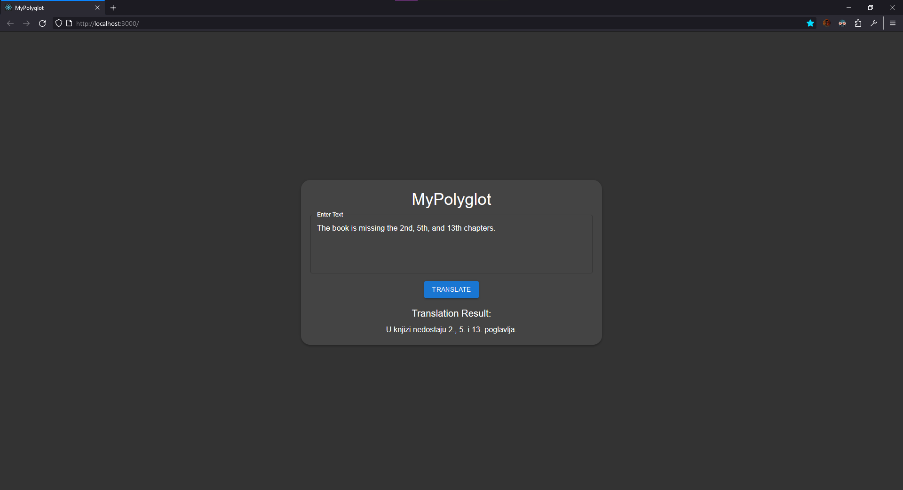

# MyPolyglot (Under Development)

MyPolyglot is an ongoing project developed for the Artificial Intelligence course at the Faculty of Information Technologies. It leverages the power of Marian NMT (Neural Machine Translation), a locally built translation framework, to provide seamless translation capabilities through a Go API and a React app.

**Note: This project is currently under development, and certain features may be incomplete or subject to change. Feel free to explore.**

## Overview

The project combines cutting-edge AI technologies to create a polyglot experience, enabling users to easily translate text from one language to another. The key components include:

- **Marian NMT:** An efficient Neural Machine Translation framework written in pure C++. Locally built to ensure seamless integration into the project.

- **Go API:** A backend API developed in Go (Golang) to handle translation requests. It communicates with the Marian NMT model to provide fast and accurate translations.

- **React App:** A user-friendly front-end built with React, allowing users to interact with the translation service. The app features a sleek design and offers a seamless translation experience.

## Getting Started

### Prerequisites

- [Go](https://golang.org/doc/install)
- [Node.js](https://nodejs.org/)
- [Marian NMT](https://marian-nmt.github.io/docs/)

### Installation

1. Clone the repository, then initialize and update the submodule (Marian NMT project):

   ```bash
   git clone https://github.com/EsrefPivcic/MyPolyglot
   cd MyPolyglot
   git submodule init
   git submodule update

2. Before running MyPolyglot, you need to build the Marian NMT framework. Navigate to the Marian NMT Visual Studio project and open the Readme file:

   ```bash
   cd marian/vs
   README.md

3. Follow the instructions in the MarianNMT Readme to build the project. Note that you'll need at least one of the following:
  - NVIDIA GPU
  - Intel CPU

    Having both is the recommended option for optimal performance.

    After building, you should find the Marian NMT binary in the marian/build/debug folder.

    **Known issues:**
    - If you run "CheckOrInstallDeps.bat" and it won't locate your Intel MKL installation folder you shold open the command prompt (in marian/vs folder) and run these commands (assuming your Intel MKL installation path is the default one: "C:\Program Files (x86)\Intel\oneAPI\mkl\latest" - if not, use the actual path to your Intel MKL installation folder in commands below):

      ```bash
      set MKLROOT=C:\Program Files (x86)\Intel\oneAPI\mkl\latest
      set MKL_LIB_DIR=C:\Program Files (x86)\Intel\oneAPI\mkl\latest\lib
      cd "C:\Program Files (x86)\Intel\oneAPI\mkl\latest\lib"
      mklink /D intel64 .
    Now run "CheckOrInstallDeps.bat" and it should work.

    - When you open the root folder of the Marian repository in Visual Studio (marian/vs/README.md -> at line 42 "1. Use VS2017+ with built-in support for CMake") and get this error:
      
      ```bash
      [CMake]   Could not find toolchain file:
      1> [CMake]   C:\path\to\marian-dev\vs\deps\vcpkg\scripts\buildsystems\vcpkg.cmake
    You should open the "CMakeSettings.json" and set VCPKG_ROOT like this: "C:\\Desktop\\MyPolyglot\\marian\\vs\\deps\\vcpkg" (Assuming you cloned the repo on your Desktop, if not use the actual path to MyPolyglot repo + "\\marian\\vs\\deps\\vcpkg").
    Also you should check the "MKLROOT" line and set it to the installation folder of Intel MKL, "C:\\Program Files (x86)\\Intel\\oneAPI\\mkl\\latest" is the default path.
    Now Visual studio should be able to generate CMake Cache.

    - If pressing 'F7' won't build the project (after generating CMake Cache), right click on "CMakeLists.txt" and click "Build".
   
    - If building the project throws an error at:
      
      ```bash
      FAILED: src/CMakeFiles/marian.dir/microsoft/sentencepiece.cpp.obj
     More specifically, if errors appear in the hash.h file (marian/src/3rd_party/sentencepiece/third_party/protobuf-lite/google/protobuf/stubs), you should replace it with the modified hash.h file I provided in "hash_fix" folder.
     After replacing the hash.h file, the build should be successful.
         
4. Install dependencies for the Go API and run it:

   ```bash
   cd ../../go-api
   go mod download
   go run main.go

5. Install dependencies for the React App and run it:

   ```bash
   cd ../react-app
   npm install
   npm start

6. Visit http://localhost:3000 to access the MyPolyglot app.


## Screenshot


## Citation

I want to express my gratitude to the Marian Neural Machine Translation framework, a vital component of this project. If you use Marian in your work, please make sure to cite the following paper:

    @InProceedings{mariannmt,
        title     = {Marian: Fast Neural Machine Translation in {C++}},
        author    = {Junczys-Dowmunt, Marcin and Grundkiewicz, Roman and
                     Dwojak, Tomasz and Hoang, Hieu and Heafield, Kenneth and
                     Neckermann, Tom and Seide, Frank and Germann, Ulrich and
                     Fikri Aji, Alham and Bogoychev, Nikolay and
                     Martins, Andr\'{e} F. T. and Birch, Alexandra},
        booktitle = {Proceedings of ACL 2018, System Demonstrations},
        pages     = {116--121},
        publisher = {Association for Computational Linguistics},
        year      = {2018},
        month     = {July},
        address   = {Melbourne, Australia},
        url       = {http://www.aclweb.org/anthology/P18-4020}
    }

More information on https://marian-nmt.github.io

- [Quick start](https://marian-nmt.github.io/quickstart)
- [Installation and usage documentation](https://marian-nmt.github.io/docs)
- [Usage examples](https://marian-nmt.github.io/examples)

## Acknowledgements

The development of Marian received funding from the European Union's
_Horizon 2020 Research and Innovation Programme_ under grant agreements
688139 ([SUMMA](http://www.summa-project.eu); 2016-2019),
645487 ([Modern MT](http://www.modernmt.eu); 2015-2017),
644333 ([TraMOOC](http://tramooc.eu/); 2015-2017),
644402 ([HiML](http://www.himl.eu/); 2015-2017),
825303 ([Bergamot](https://browser.mt/); 2019-2021),
the European Union's Connecting Europe Facility project
2019-EU-IA-0045 ([User-focused Marian](https://marian-project.eu); 2020-2022),
the Amazon Academic Research Awards program,
the World Intellectual Property Organization,
and is based upon work supported in part by the Office of the Director of
National Intelligence (ODNI), Intelligence Advanced Research Projects Activity
(IARPA), via contract #FA8650-17-C-9117.

This software contains source code provided by NVIDIA Corporation.
